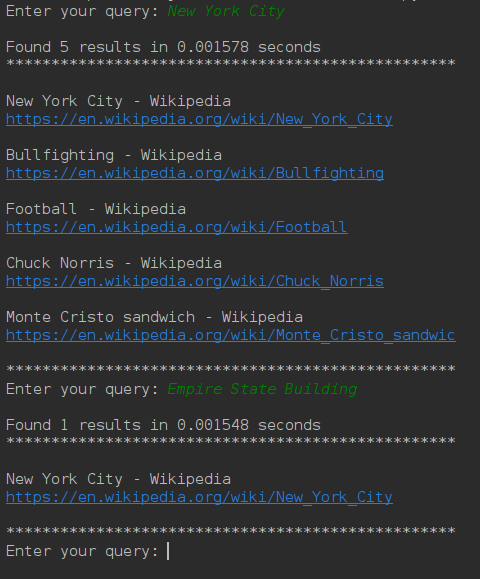
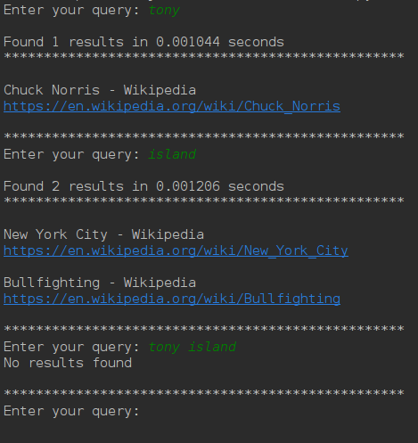
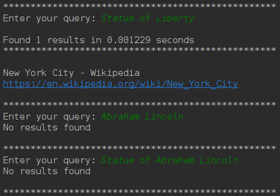
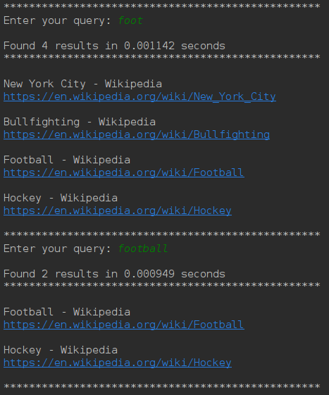
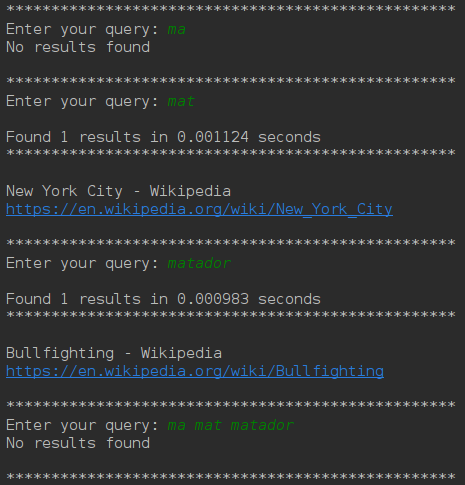
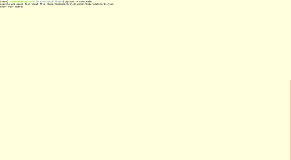

# WikiFinder

## A Wikipedia sourced search engine

### Approach and Implementation

#### Building up the Inverted Index
This search engine uses a Trie as the Inverted Index file which stores the core 
information for a search engine. The Trie traces a keyword by finding an
existing prefix and adding up the remaining characters not present in the path
but present in the word.

The urls are stored as Index in an array where an Index stores the url and has a
unique id, the nodes in trie contains an Occurrence List which holds the ids of these Indices

A Site is scraped and the text is extracted from the html of the Site after
removing html tags, html styles, script tags and other web scripts and we get
a Page which contains the title, url, cleaned text and the links to other
Site it points to.

The text from a Page is parsed and the stopwords and the punctuations are removed
and the keywords are extracted by retrieving the tokens from the cleaned text.

These keywords are then added to the inverted index or the trie with key as the word
and the url of the Page as its value.

A Node in the Inverted Index or Trie stores an Occurrence List as the value.
This OccurrenceList contains the ids of the Index the keyword occurs in.

#### Finding results for a query
When we fire a query the query string is parsed and the keywords are extracted
after removing the stopwords and the words are looked up in the Inverted Index
or the trie, if we find the word in the Trie and take the value of the node
which is an Occurrence List which stores the ids of the Index which are stored
in an array and return a list of those Index as the result.

When we fire a multi word query we return the Indexes we get from the intersection
of the Occurrence Lists of the different nodes we get from each keyword in the
query.

The union and intersection algorithm for Occurrence Lists is derived from
Algorithm 8.3 (merge) in the textbook.

### Custom Data Structures
#### Patricia Trie (Compressed Trie)
The Patricia or Compressed Trie is made up of adding Nodes to one other.
When the words in the list {"bear", "bell", "bid", "bull", "buy", "sell",
"stock", "stop", "beat", "sea", "stoop"} are added to the Patricia Trie
it would look like 

\# -> [b -> [e -> [a -> [r, t], ll], id, u -> [ll, y]], s -> [e -> [ll, a], to -> [ck, p, op]]] 

or the following in json format
```json
{
  "#":{    
    "b":{
      "e":{
        "a":{
          "r":{},
          "t":{}
        },
        "ll":{}
      },
      "id":{},
      "u":{
        "ll":{},
        "y":{}
      }
    },
    "s":{
      "e":{
        "a":{},
        "ll":{}
      },
      "to":{
        "ck":{},
        "p":{},
        "op":{}
      }
    }
  }
}
```

Note: \# is the root or "" as empty string is prefix of all strings

#### Occurrence List
This is an array type data structure which implements the union and intersection
of two lists based on the Algorithm 8.3 (merge) from the textbook

### Custom Data Types and Objects
#### Index
    The Index is like a unique node in the www, each web page is a node in the www.
    The Index is same as the Page, except Page is more bound to the web page
    containing the text of the web page, while Index stores the location of
    the node in the www
    :param index: Index of the node in the www
    :param title: Title of the web page of this node
    :param url: URL of the web page or node
    :param links_to: other Index this node points to

#### Site
    A website specifying the url or the location of the html doc of the website
    :param url: url of the website
    :param html_doc: location of the html_doc of the website

#### Page
    The web page object containing results after scraping a Site
    :param title: The title of the web page
    :param url: The url of the web page
    :param text: The cleaned text body of the web page
    :param links_to: other Page this Page points to

#### Node
    Basic element of the Trie
    :param key: The key of the node
    :param children: List of children nodes
    :param is_leaf: Is current node leaf or not, default=False
    :param value: Value of the node

### Input
#### Runtime
The input can be provided as a list of urls at runtime
```python
wiki = WikiFinder([ "https://en.wikipedia.org/wiki/New_York_City",
                    "https://en.wikipedia.org/wiki/Bullfighting"])
```

#### ```urls.lst```
A list of urls can be stored in the ```urls.lst``` file in the ```data``` folder.
If other file is to be used its location should be provided while initializing.
```python
wiki = WikiFinder(url_list="custom_file_location.txt")
``` 

#### ```urls.json```
A list of urls along with the path of the saved html documents can be
stored in the ```urls.json``` file in the ```data``` folder. The html
files are stored in the ```data/html``` folder. ```urls.json``` should follow
the following format:

```json
{
  "sites": [
    {
      "url": "https://en.wikipedia.org/wiki/New_York_City",
      "html": "New York City - Wikipedia.html"
    },
    {
      "url": "https://en.wikipedia.org/wiki/Bullfighting",
      "html": "Bullfighting - Wikipedia.html"
    }
  ]
}
```

A custom location of the file can also be used and its location needs to be
provided during initializing.

```python
wiki = WikiFinder(html_docs="custom_file_location.json")
``` 

### Output
The output is as seen




### Edge Cases
#### Intersection of two different results
As we can see the output of ```tony``` and ```island``` have nothing in
common and thus we didn't find any result when querying for ```tony island```




Here the word ```statue``` is common in the first and last query
however we didn't find any result for ```Abraham Lincoln``` thus it explains
why we didn't find any result for the last query  




#### Matching prefix from different queries
Here the prefix ```foot``` matches in both the queries however the result
varies in both cases.




Here each query is a prefix of the next next query ie. ```ma``` is a
prefix of ```mat``` and ```mat``` is a prefix of ```matador```, however
the result is different in all the three cases, as well as the intersection
of the first three query has nothing in common as can be seen in the result
of the last query

 


### Demo


